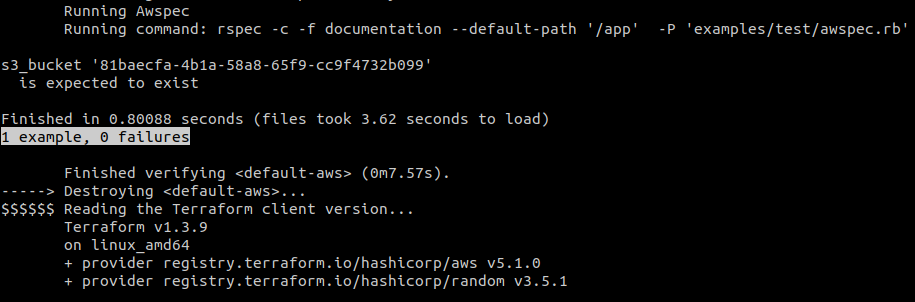

# GitOps - Creating deployment pipelines with ArgoCD for Amazon EKS

[](https://github.com/punkerside/awspec-demo/actions/workflows/main.yml)
[](https://www.codetriage.com/punkerside/awspec-demo)
[](https://github.com/punkerside/awspec-demo/issues)
[](https://github.com/punkerside/awspec-demo/tags/)


<p align="center">
  
</p>

## **Prerequisites**

* [Install AWS CLI](https://docs.aws.amazon.com/cli/latest/userguide/cli-chap-install.html)
* [Install Docker](https://docs.docker.com/engine/install/)

## **Use**

```bash
make test
```

## Autor

[Ivan Echegaray Avendaño](https://github.com/punkerside/)